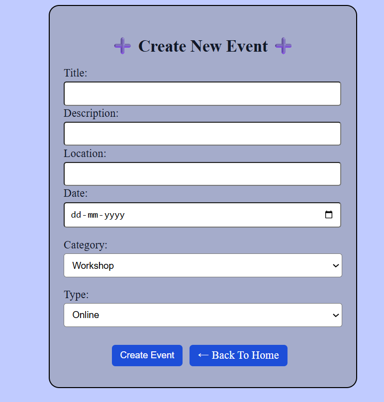

# 🎉 Event Scheduler

**Event Scheduler** is a modern React-based web app for discovering, creating, and managing local or online events like webinars, workshops, and meetups.

Fully responsive, feature-rich, and beginner-friendly — built with React, React Router, Context API, and Framer Motion.

---

## 🚀 Features

### 🗂 Event Discovery
- View a list of upcoming events
- Search and filter by **type**, **category**, or **date**
- Bookmark or attend events

### ✍️ Create Events
- Add title, description, date, location, category
- Choose between **online/offline**
- Form validation included

### 📅 Calendar View
- View all upcoming events in a timeline or calendar layout

### 🌗 Theme Toggle
- Light/Dark mode supported
- Theme is saved in localStorage

### 👤 Mock Login
- Simple username-based login system
- User data saved in localStorage
- Login/logout UI and protected routes

### 📱 Responsive Design
- Optimized for both desktop and mobile
- Responsive navbar with “More” dropdown on small screens

### 🎯 Animations
- Framer Motion scroll + route animations
- Animated dropdown menus for mobile

---

## 🛠 Tech Stack

| Tech               | Description                   |
|--------------------|-------------------------------|
| React              | Core UI framework             |
| React Router DOM   | Client-side routing           |
| Framer Motion      | Animations and transitions    |
| Context API        | State management              |
| LocalStorage       | Persistent user + event data  |
| Vanilla CSS / Inline| Styling (or Tailwind optional)|

---

## 📸 Screenshots

### ✅ Dashboard  


### 📝 Create Event  


### 👤 Login  


### 📅 Calendar View  


---

## 🔧 Installation

```bash
git clone https://github.com/your-username/EventPal.git
cd Event-Scheduler
npm install
npm start

----
📁 Folder Structure
bash
Copy
Edit
src/
├── components/         # Navbar, EventCard, etc.
├── pages/              # Home, CreateEvent, EventDetail, etc.
├── context/            # AuthContext, EventContext, ThemeContext
├── App.js
└── index.js

---
💡 Future Enhancements

✅ Google Calendar Integration

🔐 OAuth login (Google, GitHub)

🔔 Event Reminders

📊 Event analytics dashboard

🧾 Invite RSVP email simulation
